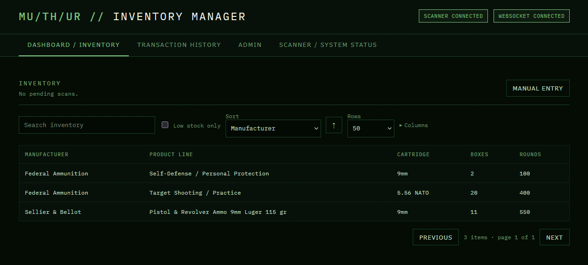
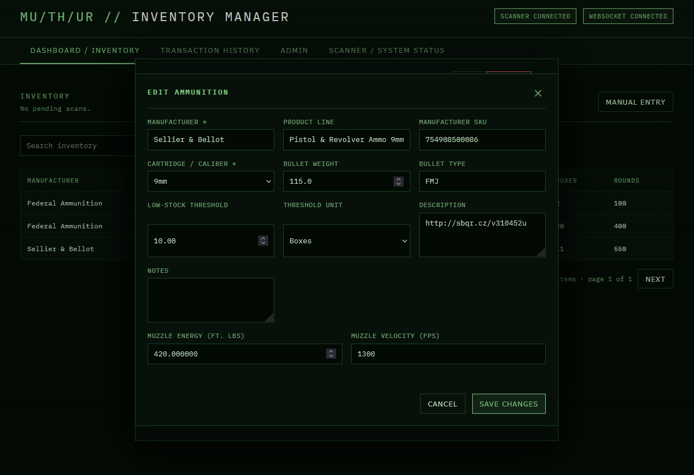
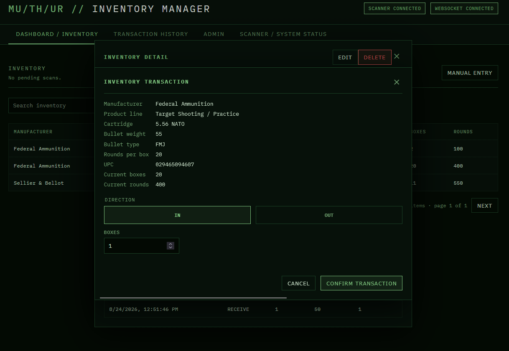
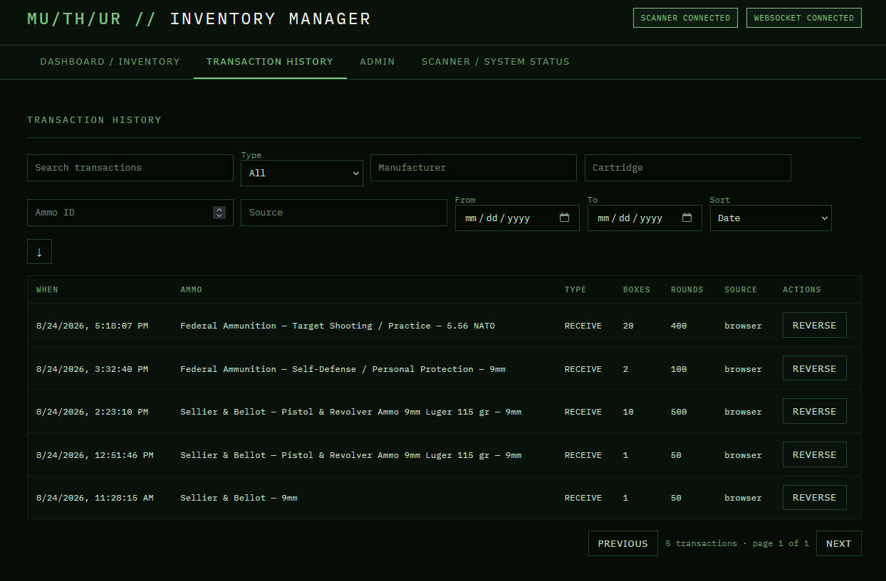
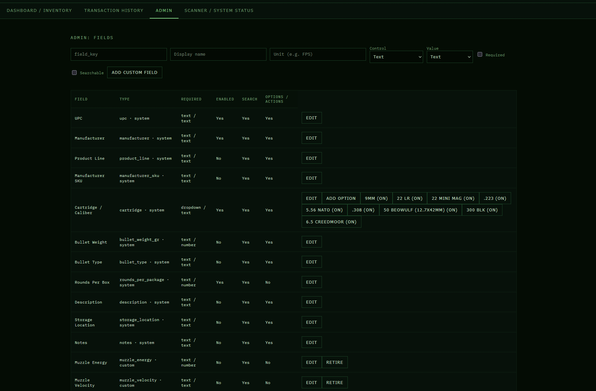

# Inventory Manager

A Raspberry Pi-hosted ammunition inventory application. It reads a USB HID
barcode scanner directly, records a durable scan event, and requires a browser
user to confirm every inventory change. Stock never changes merely because a
barcode was scanned.

The dashboard uses the MU/TH/UR terminal visual style and is designed for a
single local network deployment. See [spec.md](spec.md) for the product
requirements and [todo.md](todo.md) for implementation status.

## Capabilities

- USB HID barcode/QR scanner input through `evdev`; scanner input is independent
  of browser focus.
- Known UPCs resolve to existing ammunition; unknown UPCs open a creation form.
- Confirmed `RECEIVE`, `REMOVE`, and `ADJUST` transactions maintain immutable
  history, current box/round balances, reversal support, and idempotency keys.
- One active scan with a FIFO queue of five; duplicate scans within 500 ms are
  suppressed. The browser polls the durable active scan as a fallback if a
  WebSocket message is missed.
- Multiple UPC/package identifiers per product, configurable fields/dropdowns,
  units (for example `FPS`), locations, audit history, backups, CSV exchange,
  and persistent inventory-view preferences.
- Cartridge / Caliber is a system dropdown seeded with common calibers.
- Product deletion keeps the product and transaction audit trail but removes its
  UPC identifiers, allowing a deleted UPC to be added later as a new product.

## Interface

### Dashboard and inventory



Click an inventory row to view its complete metadata, package identifiers, and
transaction history.

### Edit inventory



### Confirm inventory transactions



### Transaction history



### Administration



## Architecture

| Layer | Responsibility |
|---|---|
| `app/scanner.py` | HID key decoding, reconnects, and idle device reopen |
| `app/services/` | Scan workflow, inventory mutation, identifiers, fields, metadata |
| `app/routers/` | REST APIs for inventory, scans, transactions, admin, data management |
| `app/models/` | SQLAlchemy domain model |
| `app/static/` | Browser UI, WebSocket client, and terminal visual system |
| `alembic/` | All production schema/data migrations |

Postgres is the durable source of truth. `AmmoProduct.box_quantity` and
`round_quantity` are denormalized balances maintained only through
`InventoryTransaction` rows.

## Configuration

Copy the example configuration:

```bash
cp .env.example .env
```

| Variable | Meaning |
|---|---|
| `POSTGRES_HOST`, `POSTGRES_PORT` | Database address |
| `POSTGRES_DB`, `POSTGRES_USER`, `POSTGRES_PASSWORD` | Database credentials |
| `SCANNER_DEVICE_PATH` | Stable Linux input-device symlink for the scanner |

Find the scanner path with:

```bash
ls -l /dev/input/by-id/
```

Use the stable `/dev/input/by-id/...` path, not `/dev/input/eventN`; event
numbers can change after reconnects. The container receives the configured
device through Compose `devices:` mapping.

## Local development

The scanner is optional for local UI/API work. The reader logs and retries if
the configured device does not exist.

```bash
docker compose up -d postgres
docker compose build app
docker compose run --rm --no-deps --entrypoint "" app alembic upgrade head
docker compose up app
```

Open `http://localhost:8000`. To run the application outside Docker, create a
virtual environment, install `requirements.txt`, point `POSTGRES_HOST` at an
available database, run `alembic upgrade head`, then run:

```bash
uvicorn app.main:app --host 0.0.0.0 --port 8000 --reload
```

## Testing

The suite covers scan decoding/queueing, transactions, idempotency, custom
field validation, UPC resolution, and key API workflows.

```bash
docker compose build app
docker run --rm -e PYTHONPATH=/app -e PYTHONPYCACHEPREFIX=/tmp/pycache \
  --mount type=bind,src="$PWD",dst=/app,readonly -w /app \
  inventory-manager-app pytest -q -p no:cacheprovider
```

## Migrations and legacy installations

Never use `Base.metadata.create_all()` in production. Apply schema changes only
with Alembic:

```bash
alembic upgrade head
```

The initial migration recognizes the original pre-Alembic `items` and
`scan_events` schema, preserves it as legacy data, and imports it into the new
model. Do not use `alembic stamp head` to bypass that migration.

To generate a migration from Docker, bind mount `alembic/` so the new revision
is retained on the host:

```bash
docker compose up -d postgres
docker compose run --rm --no-deps --entrypoint "" -v "$PWD/alembic:/app/alembic" app \
  alembic revision --autogenerate -m "description"
```

## Backup and restore

- `GET /api/data/backup` exports a portable JSON backup.
- `POST /api/data/restore?confirm_replace=true` validates then replaces all app
  data in one transaction.
- CSV exports are available for inventory, transactions, and audit history.
- Ammo CSV import supports a dry run; review all validation errors before using
  the explicit commit action.

Test backups against the actual Pi database before relying on them operationally.

## Deployment on the Pi

Jenkins reads the pipeline from [Jenkinsfile](Jenkinsfile). The Pi stores its
secrets in `/opt/inventory-manager/.env`; Jenkins symlinks that file into the
workspace during deployment.

Pipeline order is intentionally:

1. Checkout and load secrets
2. Build the new app image
3. Ensure Postgres is running and migrate with the new image
4. Start the new app container
5. Prune unused images

This avoids starting a new application version against an old schema. The
database is not published to host port 5432 because another Pi stack uses it.

## Scanner troubleshooting

The dashboard distinguishes **scanner connected** from **a scan received**:
the scanner status includes the last decoded scan time.

- If the timestamp advances but no modal appears, reload once to confirm an
  active scan exists; the normal UI also revalidates it every two seconds.
- If the timestamp does not advance, the HID reader is not receiving key
  events. Check scanner power/cable, then restart the app container to reopen
  the device.
- The reader automatically reopens an idle device after 60 seconds to recover
  from common evdev/USB idle stalls.
- If a scan is already awaiting confirmation, further scans are queued (up to
  five), rather than replacing the active modal.

## Browser notes

Use a current Firefox or Chromium-based browser. The app works over HTTP on a
private-network IP; browser idempotency IDs include a fallback for Firefox,
where `crypto.randomUUID()` is unavailable in an insecure context. If a fresh
deployment appears unchanged, hard-refresh (`Ctrl+Shift+R`) to reload static
JavaScript and CSS.

## Contributing

Run tests and `git diff --check` before committing. Do not commit `.env` files
or scanner/device secrets. Do not push automatically from an agent session;
review and push changes deliberately.
